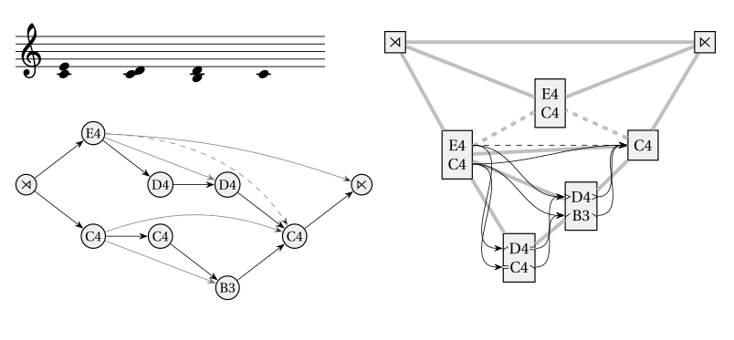

# Protovoices - A Model of Tonal Structure



This project is an implementation of the protovoice model as described in:

Finkensiep, Christoph, and Martin Rohrmeier. 2021. “Modeling and Inferring Proto-Voice Structure in Free Polyphony.”
In Proceedings of the 22nd International Society for Music Information Retreival Conference, 189–96. Online.
[](https://doi.org/10.5281/zenodo.5624431)

It provides types and functions for representing and working with protovoice derivations,
various parser implementations,
plotting functionality,
and a probabilistic model.

Have a look at the [documentation](https://dcmlab.github.io/protovoices-haskell/)

## Overview

This project is split into two packages
- `protovoices` for the main model code
- `protovoices-rl` for a parser that is trained through reinforcement learning

### `protovoices`

#### Library (`protovoices/src/`)

The library part of the project (which implements the model) contains two types of modules,
generic modules, which work on generic "path grammars"
(with the common "outer operations" `split`, `spread`, and `freeze`)
and modules that are specific to the protovoice grammar.

- [Common](protovoices/src/Common.hs)
  ([docs](https://dcmlab.github.io/protovoices-haskell/proto-voice-model-0.1.0.0/Common.html))
  Common types and functions for representing and working with generic "path grammars" and their derivations.
- [Display](protovoices/src/Display.hs)
  ([docs](https://dcmlab.github.io/protovoices-haskell/proto-voice-model-0.1.0.0/Display.html))
  Generic code for plotting path grammar derivations.
- [ChartParser](protovoices/src/ChartParser.hs)
  ([docs](https://dcmlab.github.io/protovoices-haskell/proto-voice-model-0.1.0.0/ChartParser.html))
  A semiring chart parser that exhaustively parses a path grammar.
  - [Scoring.FunTyped](protovoices/src/Scoring/FunTyped.hs)
    ([docs](https://dcmlab.github.io/protovoices-haskell/proto-voice-model-0.1.0.0/Scoring-FunTyped.html))
    A representation of semiring scores with "holes" based on closures (used by the chart parser).
  - [Scoring.Deprecated.Flat](protovoices/src/Scoring/Deprecated/Flat.hs)
    ([docs](https://dcmlab.github.io/protovoices-haskell/proto-voice-model-0.1.0.0/Scoring-Deprecated-Flat.html))
    Partial semiring scores based on lists (previously used by the chart parser).
- [GreedyParser](protovoices/src/GreedyParser.hs)
  ([docs](https://dcmlab.github.io/protovoices-haskell/proto-voice-model-0.1.0.0/GreedyParser.html))
  A greedy parser that tries to find a single parse for a path grammar
  by choosing the next reduction step according to a policy (e.g., randomly).
- [PVGrammar](protovoices/src/PVGrammar.hs)
  ([docs](https://dcmlab.github.io/protovoices-haskell/proto-voice-model-0.1.0.0/PVGrammar.html))
  Representing protovoice derivations and their operations.
  - [PVGrammar.Parse](protovoices/src/PVGrammar/Parse.hs)
    ([docs](https://dcmlab.github.io/protovoices-haskell/proto-voice-model-0.1.0.0/PVGrammar-Parse.html))
    The parsing direction of the PV grammar.
  - [PVGrammar.Generate](protovoices/src/PVGrammar/Generate.hs)
    ([docs](https://dcmlab.github.io/protovoices-haskell/proto-voice-model-0.1.0.0/PVGrammar-Generate.html))
    The generative direction of the PV grammar.
  - [PVGrammar.Prob.Simple](protovoices/src/PVGrammar/Prob/Simple.hs)
    ([docs](https://dcmlab.github.io/protovoices-haskell/proto-voice-model-0.1.0.0/PVGrammar-Prob-Simple.html))
    A probabilistic model of the PV grammar.

#### Executables (`protovoices/app/`)

- [MainISMIR](protovoices/app/MainISMIR.hs)
  Code for the paper linked above.
- [MainLearning](protovoices/app/MainLearning.hs)
  Code for a Bayesian inference experiment (part of my dissertation).
- [MainExamples](protovoices/app/MainExamples.hs)
  Generates or demonstrates various examples.
- [MainParsing](protovoices/app/MainParsing.hs)
  Testbed for parsing.

### `protovoices-rl`

#### Library (`pv-rl/src/`)

- [RL](pv-rl/src/RL)
  A reinforcement-learning agent for parsing pieces (uses `GreedyParser`).
  Examples of usage can be found in `MainRLChords` (see below).
  - [RL.ModelTypes](pv-rl/src/RL/ModelTypes.hs):
    type-level model parameters (e.g. tensor sizes and device).
  - [RL.Encoding](pv-rl/src/RL/Encoding.hs):
    translating protovoice datastructures into HaskTorch tensors.
  - [RL.Model](pv-rl/src/RL/Model.hs): the NN model used by the RL agents.
  - [RL.Callbacks](pv-rl/src/RL/Callbacks.hs): reward and scheduling functions.
  - [RL.DQN](pv-rl/src/RL/Model.hs): implementation of a Deep Q-Learning agent.
    - [RL.ReplayBuffer](pv-rl/src/RL/ReplayBuffer.hs): used by `RL.DQN`.
  - [RL.A2C](pv-rl/src/RL/A2C.hs): implementation of an Advantage Actor Critic agent.
    - [RL.A2CHelpers](pv-rl/src/RL/A2CHelpers.hs):
      HaskTorch helper functions used by `RL.A2C`.
  - [RL.Plotting](pv-rl/src/RL/Plotting.hs): plotting histories.
  
#### Executables (`pv-rl/app/`)

- [MainRLChords.hs](pv-rl/app/MainRLChords.hs): train the model on chords.

## Building and Running

You can build the main project with stack using:

```shell
$ stack build protovoices
```

Run any of the executables using:

```shell
$ stack exec {ismir2021,learn,examples,parse}
```

To build the documentation, run:

```shell
$ stack haddock
```

### Building the RL Parser

The RL parser uses [hasktorch](https://github.com/hasktorch/hasktorch),
which requires libtorch as a dependency.
You can get it like this:

```shell
$ cd deps
$ ./get-deps.sh {cpu,cuda,rocm}
```

To build the project, you'll need to add the path to libtorch (in `deps/libtorch/`) to the linker path,
which you can do by sourcing `deps/setenv`:

```shell
$ . deps/setenv
$ stack build
```

If you prefer using Nix, you might find a solution in the hasktorch repo.
